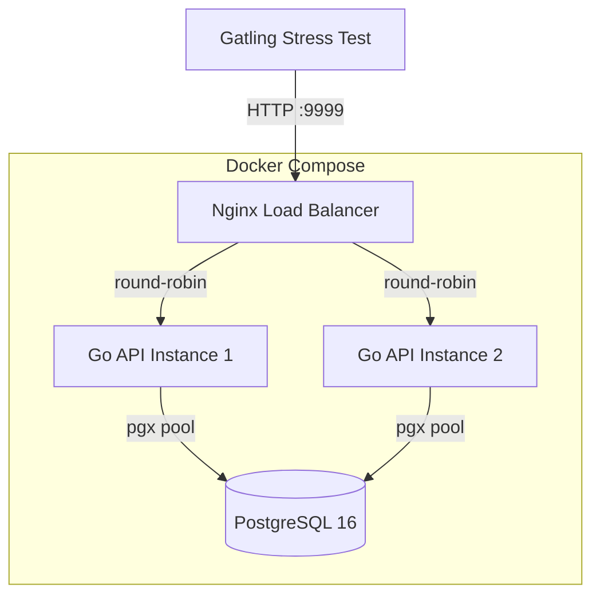

# Rinha de Backend 1 — Go

[](https://go.dev)
[](https://www.postgresql.org)
[](https://docs.docker.com/compose/)

My implementation of the [Rinha de Backend 1](https://github.com/zanfranceschi/rinha-de-backend-2023-q3) challenge — a high-performance people API stress-tested with [Gatling](https://gatling.io/).

## Architecture

The system uses an **async write-behind** strategy for maximum throughput under the challenge's strict resource constraints (1.5 CPUs / 3GB RAM total).

<!-- Deployment topology diagram -->



**Key design decisions:**

- **In-memory cache** (`sync.Map`) — O(1) nickname uniqueness checks and GET-by-ID, no DB round-trip
- **Channel-based batcher** — accumulates writes and flushes via PostgreSQL `COPY` protocol every 5ms or 500 items
- **pg_trgm GIN index** — fast substring search across name, nickname, and stack
- **Standard library only** — `net/http` with Go 1.22+ method-based routing (no frameworks)

## Tech Stack

| Component | Technology | Purpose |
|-----------|-----------|---------|
| API | Go 1.25 (`net/http`) | HTTP server, validation, caching |
| Database | PostgreSQL 16 | Persistence, full-text search |
| Driver | pgx/v5 | Connection pool, COPY protocol |
| Load Balancer | Nginx | Round-robin between 2 API instances |
| Containers | Docker Compose | Orchestration with resource limits |

## Quick Start

### Prerequisites

- [Go 1.25+](https://go.dev/dl/)
- [Docker](https://docs.docker.com/get-docker/) with Compose

### Run

```bash
# Start the full stack (builds images, starts all containers)
make up

# Verify it's working
make smoke

# View logs
make logs

# Stop
make down
```

### Development

```bash
# Run unit tests
make test-unit

# Run all tests (unit + integration, requires Docker)
make test

# Format and lint
make fmt lint

# Build binary locally
make build
```

## API Endpoints

### `POST /pessoas`

Create a person.

```bash
curl -X POST http://localhost:9999/pessoas \
  -H "Content-Type: application/json" \
  -d '{"apelido":"go","nome":"Gopher","nascimento":"2009-11-10","stack":["Go","Rust"]}'
# 201 Created | Location: /pessoas/<uuid>
```

| Field | Type | Rules |
|-------|------|-------|
| `apelido` | string | Required, unique, ≤ 32 chars |
| `nome` | string | Required, ≤ 100 chars |
| `nascimento` | string | Required, `YYYY-MM-DD` format |
| `stack` | string[] \| null | Optional, each element ≤ 32 chars |

**Error codes:** `400` (wrong types) · `422` (missing fields, duplicate nickname)

### `GET /pessoas/:id`

Get a person by UUID.

```bash
curl http://localhost:9999/pessoas/f7379ae8-8f9b-4cd5-8221-51efe19e721b
# 200 OK | 404 Not Found
```

### `GET /pessoas?t=:term`

Search people (case-insensitive substring match across nickname, name, and stack).

```bash
curl "http://localhost:9999/pessoas?t=go"
# 200 OK (JSON array, max 50 results) | 400 if ?t is missing
```

### `GET /contagem-pessoas`

Count total people (plain text).

```bash
curl http://localhost:9999/contagem-pessoas
# 200 OK → "42"
```

## Resource Allocation

Total budget: **1.5 CPUs** / **3.0 GB RAM**

| Container | CPU | Memory | Rationale |
|-----------|-----|--------|-----------|
| API 1 | 0.20 | 0.3 GB | Go is CPU/memory efficient |
| API 2 | 0.20 | 0.3 GB | Same as API 1 |
| Nginx | 0.10 | 0.2 GB | Minimal proxying |
| PostgreSQL | 1.00 | 2.2 GB | Handles persistence + search |

## Project Structure

```
.
├── cmd/api/main.go          # Entry point, dependency wiring, graceful shutdown
├── internal/
│   ├── person/
│   │   ├── model.go         # Person struct, JSON validation (RawMessage)
│   │   ├── cache.go         # In-memory cache (sync.Map)
│   │   ├── repository.go    # PostgreSQL queries (COPY, ILIKE)
│   │   ├── batcher.go       # Channel-based batch writer
│   │   └── handler.go       # HTTP handlers
│   └── server/
│       └── server.go        # Route registration
├── db/init.sql              # Schema + pg_trgm index
├── tests/integration_test.go # testcontainers integration tests
├── Dockerfile               # Multi-stage build
├── docker-compose.yml       # Full stack with resource limits
├── nginx.conf               # Load balancer config
└── Makefile                 # All dev commands
```

## Make Targets

```
make help              Show all available targets
make build             Build the application binary
make run               Build and run locally
make test              Run all tests
make test-unit         Run unit tests with race detection
make test-integration  Run integration tests (requires Docker)
make test-short        Run only unit tests (skip integration)
make lint              Run static analysis
make fmt               Format all Go source files
make tidy              Tidy and verify module dependencies
make up                Start full Docker stack
make down              Stop Docker stack
make logs              Tail all container logs
make smoke             Run smoke test against running stack
make clean             Remove artifacts and stop containers
```

## Performance Optimizations

1. **Async writes** — POST returns 201 immediately; DB insert happens in background batch
2. **COPY protocol** — batch inserts via `pgx.CopyFrom` (10-50x faster than individual INSERTs)
3. **In-memory nickname set** — duplicate check without DB query
4. **Connection pooling** — pgxpool with 30 max / 10 min connections per instance
5. **PostgreSQL tuning** — `synchronous_commit=off`, large `shared_buffers`, high `work_mem`
6. **Stripped binary** — compiled with `-ldflags "-s -w"` for smaller image
7. **GIN trigram index** — substring search without sequential scan

## License

MIT
