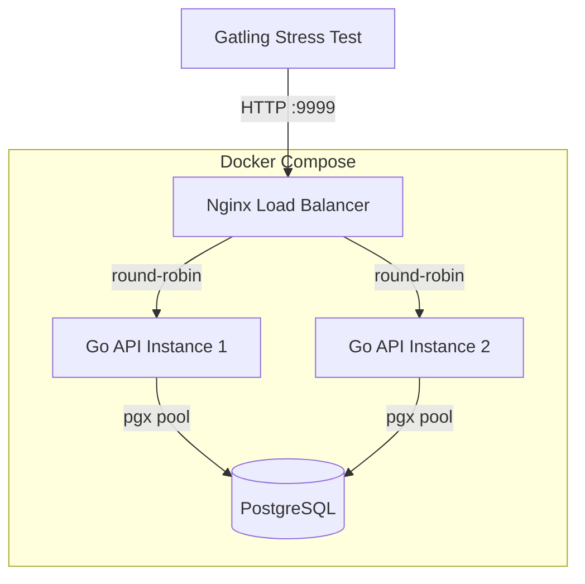
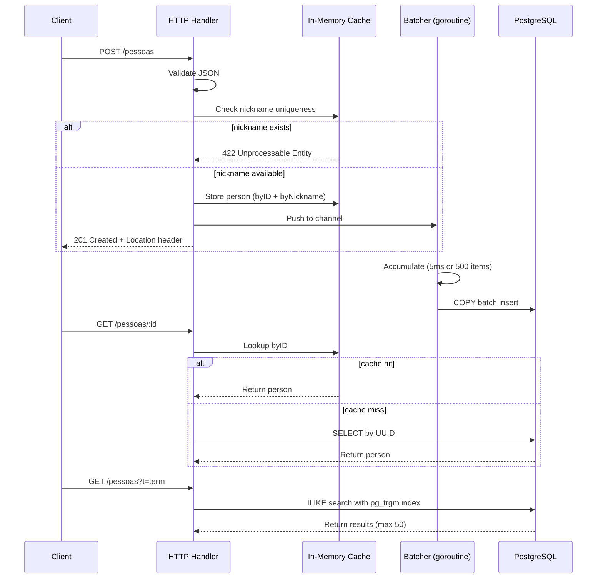

# Rinha de Backend 2023 Q3 — Go Implementation Design

## Overview

A high-performance people (pessoas) API built in Go for the [Rinha de Backend 2023 Q3](https://github.com/zanfranceschi/rinha-de-backend-2023-q3) challenge. The API manages person records with CRUD and search capabilities, deployed via Docker Compose behind an Nginx load balancer with strict CPU/memory constraints.

**Tech stack:** Go (stdlib `net/http`), PostgreSQL, pgx, Nginx, Docker.

## Architecture

The system uses an **async write-behind** strategy: writes are validated and cached in-memory, then batch-flushed to Postgres via a channel-based batcher goroutine. Reads are served from cache first with DB fallback.

### Deployment topology



### Request data flow



## Project Structure

```
rinha-de-backend-1-2023/
├── cmd/api/main.go             # Entry point, dependency wiring, graceful shutdown
├── internal/
│   ├── person/
│   │   ├── model.go            # Person struct, JSON unmarshalling, validation
│   │   ├── handler.go          # HTTP handlers (Create, GetByID, Search, Count)
│   │   ├── cache.go            # In-memory cache using sync.Map
│   │   ├── repository.go       # PostgreSQL repository (pgx queries)
│   │   └── batcher.go          # Channel-based batch writer goroutine
│   └── server/
│       └── server.go           # HTTP server setup, route registration
├── db/
│   └── init.sql                # Database schema, extensions, indexes
├── tests/
│   ├── person_handler_test.go  # Unit tests with mocked dependencies
│   └── integration_test.go     # Integration tests with testcontainers
├── Dockerfile                  # Multi-stage build
├── docker-compose.yml          # Full deployment with resource limits
├── nginx.conf                  # Load balancer configuration
├── go.mod
└── go.sum
```

## Data Model

### Go struct

```go
type Person struct {
    ID         uuid.UUID `json:"id"`
    Apelido    string    `json:"apelido"`    // nickname, unique, max 32 chars
    Nome       string    `json:"nome"`       // name, max 100 chars
    Nascimento string    `json:"nascimento"` // birthdate, YYYY-MM-DD
    Stack      []string  `json:"stack"`      // optional, each element max 32 chars
}
```

### PostgreSQL schema

```sql
CREATE EXTENSION IF NOT EXISTS pg_trgm;

CREATE TABLE pessoas (
    id           UUID PRIMARY KEY,
    apelido      VARCHAR(32) UNIQUE NOT NULL,
    nome         VARCHAR(100) NOT NULL,
    nascimento   DATE NOT NULL,
    stack        TEXT,
    search_field TEXT NOT NULL
);

CREATE INDEX idx_pessoas_search ON pessoas USING GIN (search_field gin_trgm_ops);
```

- `stack` is stored as comma-separated text in the DB, parsed to/from `[]string` in Go.
- `search_field` is a pre-computed lowercase concatenation: `LOWER(apelido || ' ' || nome || ' ' || COALESCE(stack, ''))`. Built in Go before sending to the batcher. Used for trigram-based substring search.

## API Endpoints

### POST /pessoas

Creates a new person record.

**Request body:**
```json
{
    "apelido": "josé",
    "nome": "José Roberto",
    "nascimento": "2000-10-01",
    "stack": ["C#", "Node", "Oracle"]
}
```

**Validation rules:**
- `apelido`: required, string, unique, ≤ 32 characters
- `nome`: required, string, ≤ 100 characters
- `nascimento`: required, string in `YYYY-MM-DD` format
- `stack`: optional (null allowed), array of strings, each element ≤ 32 characters

**Response codes:**
- `201 Created` — success, with `Location: /pessoas/:id` header
- `400 Bad Request` — syntactic error (wrong field types, e.g., number where string expected)
- `422 Unprocessable Entity` — semantic error (missing required field, duplicate nickname)

**Implementation:** Validate → check nickname in cache → generate UUID → store in cache → push to batcher channel → return 201 immediately.

### GET /pessoas/:id

Returns a person by UUID.

**Response:** 200 with person JSON, or 404 if not found.

**Implementation:** Look up in-memory cache first. On cache miss, query Postgres.

### GET /pessoas?t=:term

Searches people by term across `apelido`, `nome`, and `stack` elements. Case-insensitive substring match.

**Response:** 200 with JSON array (max 50 results). Empty array `[]` if no matches. 400 if `t` query parameter is missing.

**Implementation:** Query Postgres using `search_field ILIKE '%' || $1 || '%'` with `pg_trgm` GIN index. Limit 50 results.

### GET /contagem-pessoas

Returns the total count of people as plain text. Not performance-critical — queries Postgres directly.

## Caching Strategy

Two `sync.Map` instances provide lock-free concurrent access:

1. **`byID`** (`map[UUID]*Person`): Serves `GET /pessoas/:id` from memory. Populated on every successful `POST`.
2. **`byNickname`** (`map[string]struct{}`): O(1) nickname uniqueness check. Prevents duplicate DB inserts without a round-trip.

The cache is unbounded. Given the challenge constraints (3GB total, person records are ~200 bytes each), even 1M records would use ~200MB — well within limits.

Both API instances maintain independent caches. Since Nginx uses round-robin, a person created on API1 might be queried on API2 (cache miss → DB fallback). This is acceptable because:
- The batcher flushes frequently (every 5ms)
- Cache misses degrade to a DB read, not an error

## Batch Writer (Batcher)

A single goroutine per API instance handles all DB writes:

1. Receives `*Person` from a buffered channel (capacity: 5000)
2. Accumulates items in a local slice
3. Flushes to Postgres when **either**:
   - 5ms have elapsed since last flush (`time.Ticker`)
   - Batch size reaches 500 items
4. Uses `pgx.CopyFrom` (Postgres COPY protocol) for maximum insert throughput
5. On application shutdown: stops accepting new items, drains the channel, performs final flush

**Error handling in batcher:**
- If a batch insert fails (e.g., duplicate key from other instance), individual items are retried with `INSERT ... ON CONFLICT DO NOTHING`
- Connection errors trigger exponential backoff retry

**Concurrency patterns used:**
- Buffered `chan *Person` as a work queue
- `time.Ticker` + `select` for periodic flushing
- `context.Context` for cancellation and graceful shutdown
- `sync.WaitGroup` for waiting on the batcher goroutine to finish draining

## Validation & Error Handling

### Custom JSON unmarshalling

Standard `encoding/json` cannot distinguish between a missing field, an explicit `null`, and a wrong-type value. The implementation uses `json.RawMessage` for each field to:

1. Check if the field is present in the JSON object
2. Check if the value is `null`
3. Attempt to unmarshal into the expected Go type
4. Return 400 for type mismatches, 422 for null/missing required fields

### Error response format

```json
{"error": "apelido is required"}
```

All errors return a simple JSON body. No panics — all errors are handled gracefully.

## Infrastructure

### Resource allocation

| Container  | CPU  | Memory |
|------------|------|--------|
| API 1      | 0.20 | 0.3GB  |
| API 2      | 0.20 | 0.3GB  |
| Nginx      | 0.10 | 0.2GB  |
| PostgreSQL | 1.00 | 2.2GB  |
| **Total**  | **1.50** | **3.0GB** |

Go is CPU-efficient and memory-light. Postgres gets the lion's share since it handles all persistent storage, indexing, and search queries.

### Dockerfile

Multi-stage build:
- **Build stage:** `golang:1.22-alpine`, compiles with `CGO_ENABLED=0` for a static binary
- **Runtime stage:** `alpine:3.19` (minimal footprint)
- API listens on port **8080** internally

### Nginx configuration

Round-robin load balancing between `api1:8080` and `api2:8080`, listening on port 9999.

### PostgreSQL tuning

Passed via Docker Compose command args for performance under constraints:
- `shared_buffers=512MB` — more memory for caching
- `work_mem=64MB` — larger sort/hash memory
- `max_connections=200` — handle pool from both API instances
- `synchronous_commit=off` — trades durability for write speed (acceptable for this challenge)

## Testing

### Unit tests (`person_handler_test.go`)

- Test HTTP handlers using `httptest.NewServer` / `httptest.NewRecorder`
- Dependencies (cache, repository) are injected via interfaces and mocked in tests
- Test cases:
  - Valid person creation → 201 + Location header
  - Duplicate nickname → 422
  - Missing required fields → 422
  - Wrong field types (number instead of string) → 400
  - Stack with non-string elements → 400
  - Get existing person → 200
  - Get non-existent person → 404
  - Search with results → 200 + array
  - Search without `t` param → 400

### Integration tests (`integration_test.go`)

- Use `testcontainers-go` to spin up a real Postgres instance
- Test full lifecycle: create → get by ID → search → count
- Test that the batcher actually flushes and persists to the DB
- Test concurrent creates from multiple goroutines (race condition detection)
- Run with `-race` flag to detect data races

## Dependencies

- `github.com/jackc/pgx/v5` — PostgreSQL driver with COPY support
- `github.com/google/uuid` — UUID generation
- `github.com/testcontainers/testcontainers-go` — integration test containers (test-only)
- Go standard library: `net/http`, `encoding/json`, `sync`, `context`, `time`
